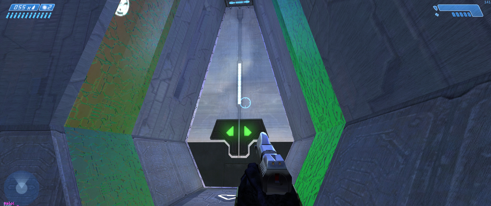
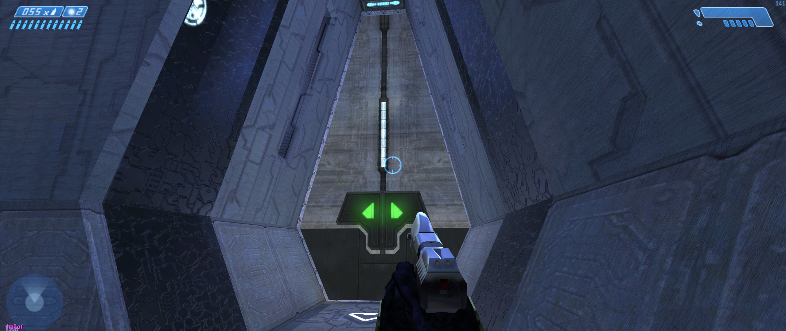
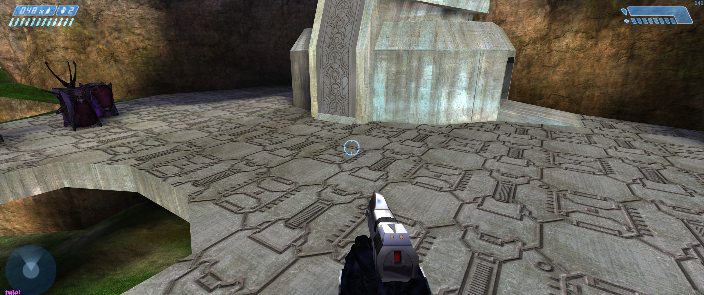
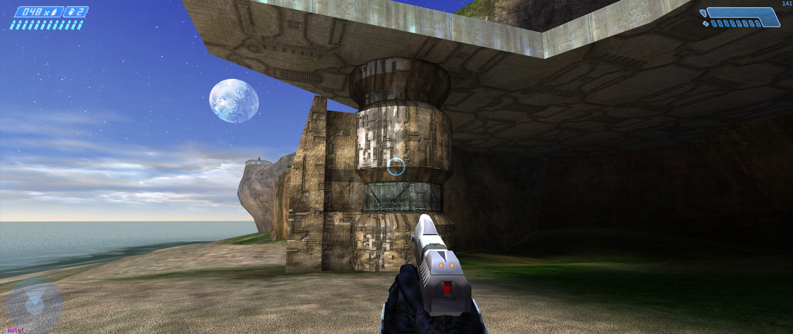

<html>
    <p align="center">
        
    </p>
    <h1 align="center">CEnshine</h1>
    <p align="center">
       Shaders enhancement for Halo Custom Edition aiming to restore Xbox accurate rendering
    </p>
    <p>&nbsp;</p>
</html>

This project is made with the goal of improving Halo Custom Edition shaders and align them with the
shaders quality provided in the MCC/Xbox version of the game, just by the joy of doing it, all of
this is the result of almost 2 weeks of hard work to bring a well deserved set of shaders to
Halo Custom Edition as Gearbox left us with broken version of almost all the shaders.

CEnshine was made possible using primarily Lua and HLSL, take a look at the source files on this
repository.

For a more deeper introduction to shader encryption see [Composer](https://github.com/JerryBrick/composer) a CLI set of programs made
with C++ for decrypting, encrypting of shaders.

**Install it with [Mercury](https://github.com/Sledmine/Mercury):**
```
mercury install censhine
```
Or manually get it from the [releases](https://github.com/Sledmine/censhine/releases) page.

# Fixes so far
Some of the things we have fixed with these shaders so far are listed below, as well as unmarked all
the things we plan to do to restore at some point as well.
- **Shader Transparent Plasma** - (Plasma based shaders will render properly, for example biped shields recharge)
- **Environment Reflection** - (Bumped surfaces now will tint correctly perpendicularly and horizontally, dynamic mirror seems to work properly now, needs testing)
- **Environment Light Maps** - (Light map direction will now apply correctly to other textures like bump maps)
- **Transparent Glass Reflection** Bumped - (Glass with bumped reflections)
- **Transparent Water** - (Water color and opacity)
- **Environment Model** - (Objects now draw behind fog, animations fade correctly, cube map alpha applies correctly)
- **Environment Texture** - (Restored normal, blended and blended base specular function types, self illumination works as expected)

**NOTE:** There are still pending some shaders and functions to fix, every feedback from what shaders are missing to fix or what they can be breaking even more is totally appreciated.

We are also trying to keep compatibility with dgVoodoo!

There are some plans to bring some removed shaders back like the **"Shader Transparent Generic"**, but that will require something a little bit more complex, stay tuned to more updates.

# Screenshots
Here are some 2K screenshots demonstrating changes between the broken shaders and the fixed ones, just
to show a few, shaders include other fixes that require looking at them in game to appreciate:

**BEFORE**

**AFTER**

**BEFORE**

**AFTER**

**BEFORE**

**AFTER**


# Building
First of all I have to keep clear that I built CEnshine using Linux so a lot of the code assumes you
are running in a Linux like environment, however I've been doing some efforts to be able to keep
the code compatible with Windows, most likely you will have to at least run some scripts from here
in Bash Windows in order to compile shaders.

## Linux requirements
In Linux there are some minimal requirements to build the code, assuming you are in a Debian based
distro like ubuntu this should be enough gather all the dependencies, you also need a working
wine configuration:
```
apt install luajit
apt install wine
apt install winetricks
winetricks dxvk
```

## Windows requirements
For Windows you will have to download a Lua interpreter from your place of preference, it needs
to be a luajit interpreter obligatory, I usually download binaries from the [luapower](https://github.com/luapower/luajit/tree/master/bin/mingw64) project.

Then make sure you have the latest version of [DirectX9 runtime](https://www.microsoft.com/en-us/download/details.aspx?id=35) installed, this contains some libraries and binaries required to compile DirectX9 shaders.

## Get it done
Not all the shaders from this repository are in a compilable state that fits well with Halo Custom
Edition, keep in mind that we are building shaders in a way that the game can use straight, so some
shaders need to be tweaked to fit what the game is expecting to find, in the future if we want to
improve shaders we will need some kind of game modification to expand shaders functionality.

As we still need some original shader files in order to allow the game to run properly we first have
to extract a set of working shaders for the game and then compile our shaders in top of those.

Run a command like this setting a path to your original shader files, it will create a **build** folder
where we can start compiling our new shaders:
```
luajit src/lua/extractCEShaders.lua $HALO_CE_PATH/shaders/EffectCollection_ps_2_0.enc --decrypt --preparebuild
```

Now just run `./shaders.sh` in the root folder of this project and that's it, a shaders file
usually named `EffectCollection_ps_2_0.enc` will be dropped in under the **dist** folder.

# Thanks to
- [JerryBrick](https://github.com/JerryBrick) - Composer tools creator, tools for decrypting and encrypting shaders **(show some love to Jerry, he is leaving the modding scene)**
- [MrChromed](https://www.youtube.com/c/MrChromed) - Halo CE Shaders veteran, providing support for validating shaders fixes
- [MarkMcFuzz](https://youtube.com/channel/UCa2MHGKv8KZFBBkkFzNBgkA) - Another Halo CE Shaders veteran, support and validation
- [Mata](https://youtube.com/channel/UCa2MHGKv8KZFBBkkFzNBgkA) - 3D expert, probably the igniter of this
  project, when Mata started to learn about HLSL we got inspired to try and attempt to fix CE
  shaders
- [C20](https://c20.reclaimers.net/h1/engine/renderer/#gearbox-regressions) - Provided a list of known shaders issues
- Halo MCC Mod Tools and 343i for finally fixing shaders with also building process for a base code

# Disclaimer
CEnshine is not and will not be related to MCC, this project does not claim to own the fixes to all
shaders presented here, most of them are based in the fixes provided by Halo Combat Evolved present
in MCC, however the codebase presented here is specifically designed to work with Halo Custom
Edition, is not meant to be aligned with shaders in MCC, further code changes will not be related to
MCC in any way, this mod and it's code belongs to a gray area where it needs to be, if this does not
work for you or you are not in agreement with this then this is not the project you should be
looking at, see **Master Chief Collection** and **Halo MCC Mod Tools** instead.
